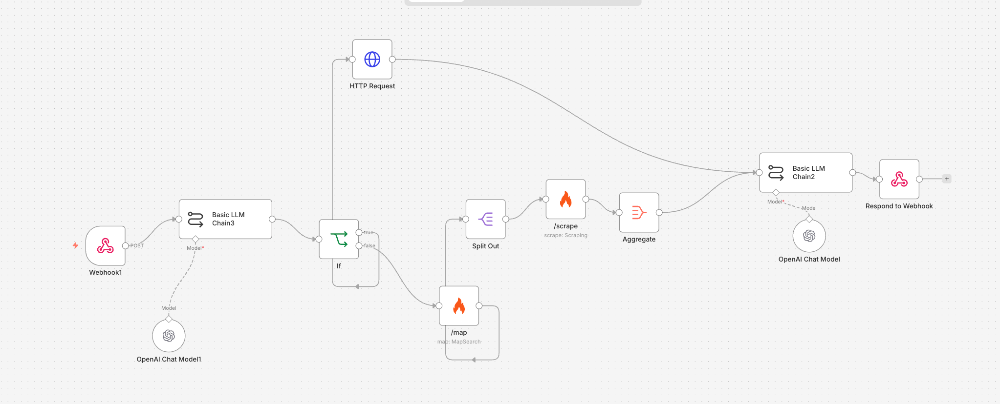

# APIlot: Read Less, Build More 🚀

APIlot is an AI-powered API navigator designed to dramatically reduce the time developers spend reading documentation. By simply pasting an API documentation URL, APIlot instantly transforms static docs into dynamic, interactive, and usable forms complete with a live payload terminal.

## ✨ Features

- **Quick Parsing**: Paste any API documentation URL and let our AI digest it within 2 minutes (Note: the n8n webhook enforces a maximum 2-minute timeout, so requests taking longer may fail).
- **Dynamic Form Generation**: The application automatically generates an interactive, usable UI form based on the scraped API structure.
- **Live Payload Terminal**: Preview and tweak your JSON payloads in real-time before making actual requests.
- **Automated Workflow**: Seamlessly integrates web scraping, large language models, and frontend rendering into a unified developer experience.

## 🛠 Tech Stack

Our robust and high-performance stack is built for speed, accuracy, and scalability:

- **Frontend**: [React](https://react.dev/) & [Vite](https://vitejs.dev/) for an ultra-fast, modern web interface.
- **Styling**: [Tailwind CSS](https://tailwindcss.com/) for a sleek, responsive, and professional UI.
- **Workflow Automation**: [n8n](https://n8n.io/) to orchestrate the backend webhooks and integrate multiple services.
- **Web Scraping**: [Firecrawl](https://www.firecrawl.dev/) for robust and deep scraping of API documentation pages.
- **AI Inference Engine**: [vLLM](https://github.com/vllm-project/vllm) to serve our massive language model efficiently.
- **Language Model**: GPT-OSS-20B for high-accuracy reasoning, parsing, and structured data generation.
- **Hardware Acceleration**: AMD MI300X GPU for bleeding-edge inference speed and maximum throughput.

## ⚙️ How It Works

1. **Input**: A developer pastes a target API documentation URL into the APIlot frontend.
2. **Trigger**: The React application sends the URL to an n8n webhook.
3. **Scrape**: n8n triggers Firecrawl to systematically scrape the documentation content.
4. **Process**: The raw documentation data is fed into our customized GPT-OSS-20B model (running on an AMD MI300X via vLLM).
5. **Structure**: The AI parses the unstructured text and returns a strictly typed JSON schema representing the API endpoints and parameters.
6. **Render**: The React frontend instantly consumes this schema, rendering a dynamic, interactive form with a live payload terminal.

### The n8n Automation Workflow
> *The image below illustrates the n8n orchestration flow handling the URL webhook, scraping, and AI processing steps.*

 <!-- Note: Please ensure the n8n screenshot is saved here or update this image path -->

## ⚖️ License & Copyright

MIT License

Permission is hereby granted, free of charge, to any person obtaining a copy
of this software and associated documentation files (the "Software"), to deal
in the Software without restriction, including without limitation the rights
to use, copy, modify, merge, publish, distribute, sublicense, and/or sell
copies of the Software, and to permit persons to whom the Software is
furnished to do so, subject to the following conditions:

The above copyright notice and this permission notice shall be included in all
copies or substantial portions of the Software.

THE SOFTWARE IS PROVIDED "AS IS", WITHOUT WARRANTY OF ANY KIND, EXPRESS OR
IMPLIED, INCLUDING BUT NOT LIMITED TO THE WARRANTIES OF MERCHANTABILITY,
FITNESS FOR A PARTICULAR PURPOSE AND NONINFRINGEMENT. IN NO EVENT SHALL THE
AUTHORS OR COPYRIGHT HOLDERS BE LIABLE FOR ANY CLAIM, DAMAGES OR OTHER
LIABILITY, WHETHER IN AN ACTION OF CONTRACT, TORT OR OTHERWISE, ARISING FROM,
OUT OF OR IN CONNECTION WITH THE SOFTWARE OR THE USE OR OTHER DEALINGS IN THE
SOFTWARE.
